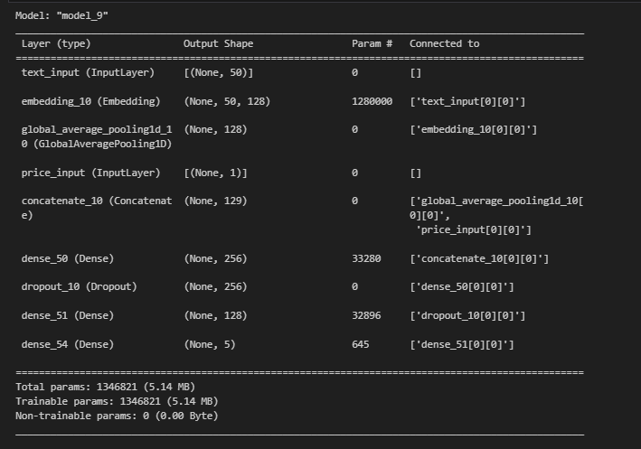
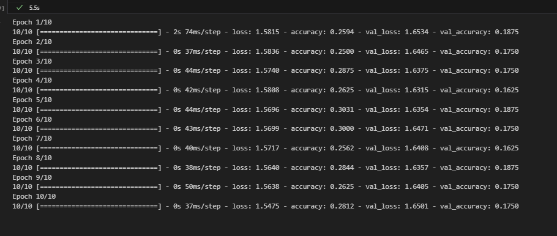
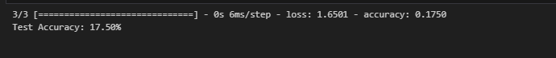
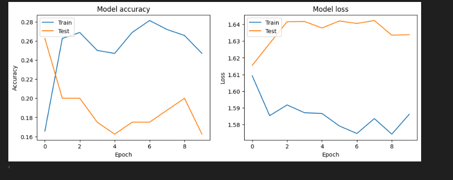
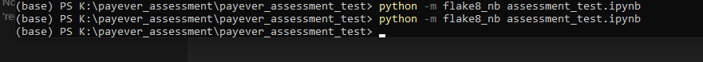

# payever_assessment_test
Project Overview
This project aims to develop a machine learning model for classifying dummy products into predefined categories using TensorFlow. The model leverages attributes such as product name, description, and price to predict the category of the products. The code demonstrates data generation, preprocessing, model training, and evaluation.

Prerequisites
To run this project, ensure you have the following installed:

Python 3.9 or above
Jupyter Notebook

Installation

Follow these steps to set up the project on your local machine:

Clone the Repository

git clone https://github.com/samarmubarakpk/payever_assessment_test.git
cd <repository_directory>

Install Required Packages
Create a requirements.txt file in your project directory and add the following content:

# Data manipulation and numerical computations
pandas==1.3.3
numpy==1.21.2

# Machine learning and neural networks
tensorflow==2.6.0
scikit-learn==0.24.2

# Linting and code quality
flake8==3.9.2
flake8_nb==0.0.3

# Jupyter Notebook
jupyter==1.0.0
Install the packages using the following command:

pip install -r requirements.txt

Run the Jupyter Notebook

jupyter notebook assessment_test.ipynb

Data Generation
The dataset consists of dummy products created with the following attributes:

Name: The name of the product.
Description: A brief description of the product.
Price: The price of the product.
Category: The predefined category of the product (e.g., Electronics, Clothing, etc.).
Example Data
Here's an example of the generated dataset:

Name	             Description	                Price	    Category
Wireless Headphones	 Noise-cancelling headphones	79.99	    Electronics
Running Shoes	     Lightweight running  shoes	    59.99	    Clothing

Data Preprocessing
Data preprocessing steps include:

Encoding categorical labels into numerical format.
Splitting the dataset into training and testing sets.
Normalizing the price feature to ensure consistent scaling.

Model Development
The model is developed using TensorFlow and consists of the following layers:

Input layer to accept the features.
Embedding layer for categorical data.
Dense layers for learning complex patterns.

Model Evaluation
After training, the model's performance is evaluated using metrics such as accuracy and confusion matrix.

Linting
To ensure code quality, use flake8 for linting.

<!-- Screenshots

 -->
# Screenshots

